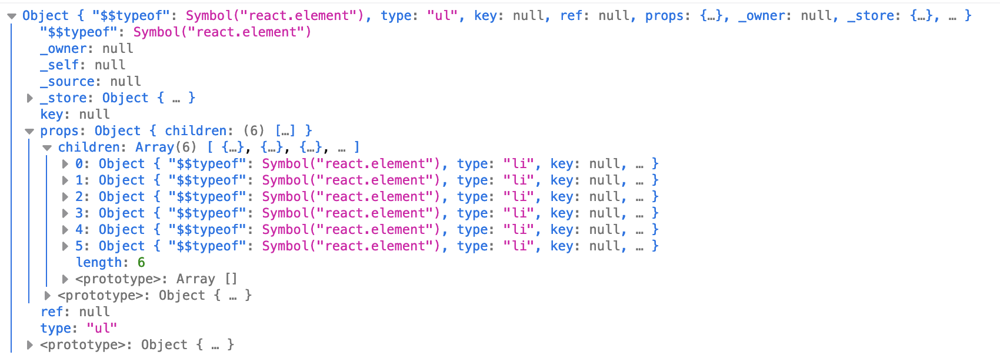
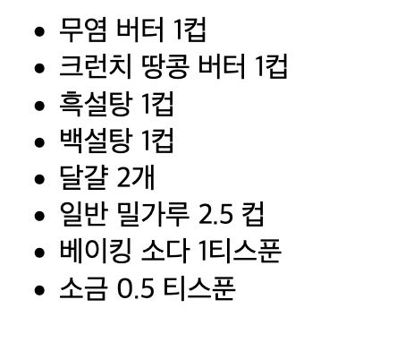

## 4.1 페이지 설정

리액트를 브라우저에서 다루려면 **React** 와 **ReactDOM** 라이브러리를 불러와야한다.  
**React**는 뷰를 만들기 위한 라이브러리고,  
**ReactDOM**은 UI를 실제로 브라우저에 렌더링 할때 사용하는 라이브러리다.

두 라이브러리는 unpkg CDN 스크립트로 바로 다운로드 할 수 있다.

## 4.2 리액트 엘리먼트

HTML은 브라우저가 문서 객체 모델(DOM)을 구성하기 위해 따라야하는 절차라고 말할 수 있다.  
HTML 문서를 이루는 엘리먼트는 브라우저가 HTML 문서를 읽어들이면 DOM 엘리먼트가 되고,  
이 DOM이 사용자 인터페이스를 화면에 표시한다.

레시피를 보여주기 위한 HTML 구조를 만들어보자.

```html
<section id="baked-salmon">
  <h1>구운 연어</h1>
  <ul class="ingredients">
    <li>연어 900그램</li>
    <li>신선한 로즈마리 5가지</li>
    <li>올리브 오일 2스푼</li>
    <li>작은 레몬 2조각</li>
    <li>코셔 소금 1티스푼</li>
    <li>다진 마늘 4쪽</li>
  </ul>
  <section id="instructions">
    <h1>조리 과정</h1>
    <p>오븐을 190도로 예열한다</p>
    <p>알루미늄 호일에 올리브 오일을 가볍게 두른다</p>
    <p>연어를 포일에 올린다</p>
    <p>로즈마리, 레몬, 다진마늘을 연어 위에 얹는다</p>
    <p>완전히 익을 때까지 15-20분간 굽는다</p>
  </section>
</section>
```

전통적으로 웹사이트는 독립적인 HTML 페이지들로 만들어졌다.  
사용자가 페이지 사이를 이동하면서 브라우저는 매번 다른 HTML 문서를 요청해서 로딩했었다.

**AJAX**가 생기면서 **단일 페이지 애플리케이션(SPA)** 가 생겼는데,  
브라우저가 AJAX를 사용해서 아주 작은 데이터를 요청해 가져올 수 있게 됨에 따라,  
이제는 전체 웹 애플리케이션이 한 페이지로 실행되면서 UI를 갱신할 수 있게 되었다.

SPA는 처음에 HTML 문서 하나만 적재된다.  
사용자는 사이트를 내비게이션하지만, 실제로는 같은 페이지안에 계속 머문다.  
자바스크립트는 사용자가 애플리케이션과 상호 작용하는 것에 맞춰 기존 인터페이스에서 새로운 UI를 만든다.  
실제로 같은 HTML 페이지 안에 머물고, 자바스크립트가 모든 처리를 대신 해준다.

**DOM API**는 브라우저의 DOM을 변경하기 위해 자바스크립트가 사용할 수 있는 객체의 모음이다.  
화면에 표시된 DOM 엘리먼트를 JS로 갱신하거나 변경하기는 상대적으로 쉽다.

리액트도 브라우저 DOM을 갱신해주기 위해 만들어진 라이브러리다.  
리액트가 모든 처리를 맡아서 하기 때문에 SPA를 효율적으로 만들기 위해 여러 내용을 신경쓸 필요가 없다.

리액트에서는 DOM API를 직접 조작하지 않고, 어떤 UI를 생성할지 지시하면 명령에 따라 렌더링을 해준다.  
리액트에서는 리액트 엘리먼트로 이뤄진 **가상 DOM**으로 이뤄진다.

가상 DOM은 실제 DOM 엘리먼트와 비슷하지만 자바스크립트 객체이다.  
이는 실제 DOM API를 직접 다루는 것보다 훨씬 빠르다.  
우리가 가상 DOM을 변경하면 리액트는 DOM API를 통해 그 변경사항을 가장 효율적으로 렌더링해준다.

리액트 엘리먼트는 브라우저 DOM을 만드는 방법을 알려주는 명령이다.

```javascript
React.createElement("h1", { id: "recipe-0" }, "구운 연어")

// <h1 id="recipe-0">구운 연어</h1>
```

첫번째 인자로 엘리먼트의 타입을 정의하고,  
두번째 인자는 엘리먼트의 프로퍼티를 정의한다.  
세번째 인자는 여는 태그와 닫는 태그 사이에 들어갈 자식 노트를 표현한다.

리액트 엘리먼트는 DOM 엘리먼트를 구성하는 방법을 알려주는 리터럴에 불과하다.

```javascript
{
  $$typeof: Symbol(React.element),
  "type": "h1",
  "key": null,
  "ref": null,
  "props": { id: 'recipe-9', children: '구운 연어'},
  "_owner": null,
  "_store": {}
}
```

리액트 엘리먼트의 type 프로퍼티는 만들고자하는 HTML이나 SVG 엘리먼트의 타입을 지정한다.  
props 프로퍼티는 DOM을 만들기 위해 필요한 데이터나 자식 엘리먼트를 표현한다.

## 4.3 React DOM

리액트 엘리먼트를 만들면 브라우저에서 보고 싶을 것이다.  
ReactDOM 에는 리액트 엘리먼트를 브라우저에 렌더링하는데 필요한 모든 도구 (`render()`) 가 들어있다.

리액트 엘리먼트와 그 자식들을 함께 렌더링하기 위해 `ReactDOM.render`를 사용한다.  
이 함수의 첫 번째 인자는 렌더링할 자식의 리액트 엘리먼트이며,  
두 번째 인자는 렌더링이 일어날 대상 DOM 노드이다.

```javascript
var dish = React.createElement("h1", null, "구운 연어")
ReactDOM.render(dish, document.getElementById("root"))

// <body>
//   <div id="root">
//     <h1>구운 연어</h1>
//   </div>
// </body>
```

dish 엘리먼트를 렌더링하면 "root" id 를 가진 div 의 자식으로 h1 엘리먼트가 추가된다.

### 4.3.1 자식들

리액트는 **props.childern** 을 사용해 자식 엘리먼트들을 렌더링한다.  
텍스트가 아닌 다른 리액트 엘리먼트를 자식으로 렌더링 할 수도 있고, 그렇게 하면 **엘리먼트의 트리**가 생긴다.

```html
<ul>
  <li>연어 900그램</li>
  <li>신선한 로즈마리 5가지</li>
  <li>올리브 오일 2스푼</li>
  <li>작은 레몬 2조각</li>
  <li>코셔 소금 1티스푼</li>
  <li>다진 마늘 4쪽</li>
</ul>
```

재료 정보가 들어 있지 않은 리스트를 생각해보자.  
ul 이 루트 엘리먼트이며, 그 엘리먼트에는 6개의 li 자식 엘리먼트가 있다.  
위 엘리먼트를 아래처럼 React.createElement 로 나타낼 수 있다.

```javascript
const list = React.createElement(
  "ul",
  null,
  React.createElement("li", null, "연어 900그램"),
  React.createElement("li", null, "신선한 로즈마리 5가지"),
  React.createElement("li", null, "올리브 오일 2스푼"),
  React.createElement("li", null, "작은 레몬 2조각"),
  React.createElement("li", null, "코셔 소금 1티스푼"),
  React.createElement("li", null, "다진 마늘 4쪽")
)

console.log(list)
```

해당 코드를 실행하면 결과는 아래와 같다.



props.children 배열안에 들어가 있는 모습을 볼 수 있다.  
다음은 section 엘리먼트 안에 조리법이 들어간 html을 리액트 엘리먼트로 만들어보자.

```javascript
const items = [
  "연어 900그램",
  "신선한 로즈마리 5가지",
  "올리브 오일 2스푼",
  "작은 레몬 2조각",
  "코셔 소금 1티스푼",
  "다진 마늘 4쪽",
]

React.createElement(
  "ul",
  { className: "ingredients" },
  items.map((ingredients, i) =>
    React.createElement("li", { key: i }, ingredients)
  )
)
```

리액트를 사용하는 경우 가장 큰 장점은 UI 엘리먼트와 데이터를 분리할 수 있다는 점이다.  
컴포넌트 트리를 편하게 구성하기 위해 자바스크립트 로직을 얼마든지 작성할 수 있다.

## 4.4 리액트 컴포넌트

모든 사용자 인터페이스는 여러 부분(버튼, 리스트 제목,, 등) 으로 나눠진다.  
각 박스에 들어있는 데이터는 서로 다르지만, 안에 사용되는 부품은 같다.  
리액트에선 이런 각 부분들을 **컴포넌트**라고 부른다.

컴포넌트를 사용하면 서로 다른 데이터 집합에 대해 같은 DOM 구조를 재사용할 수 있다.  
엘리먼트를 재사용 가능한 조각으로 나눌수 있는지를 고려해보자.

```javascript
// 재료
const secretIngredients = [
  "무염 버터 1컵",
  "크런치 땅콩 버터 1컵",
  "흑설탕 1컵",
  "백설탕 1컵",
  "달걀 2개",
  "일반 밀가루 2.5 컵",
  "베이킹 소다 1티스푼",
  "소금 0.5 티스푼",
]

function IngredientsList({ items }) {
  return React.createElement(
    "ul",
    { className: "ingredients" },
    items.map((ingredient, i) =>
      React.createElement("li", { key: i }, ingredient)
    )
  )
}

ReactDOM.render(
  React.createElement(IngredientsList, { items: secretIngredients }, null),
  document.getElementById("root")
)
```

IngredientsList 컴포넌트를 만들어서, props 객체에 items 배열을 넣어,  
전역 secretIngredients 이 아닌 props 객체를 통해 데이터를 얻게 한다.



IngredientsList 와 관련된 모든 내용은 한 컴포넌트 안에 캡슐화되어 있다.  
컴포넌트를 처리할 때 모든 것이 컴포넌트 내부에 들어있다.
